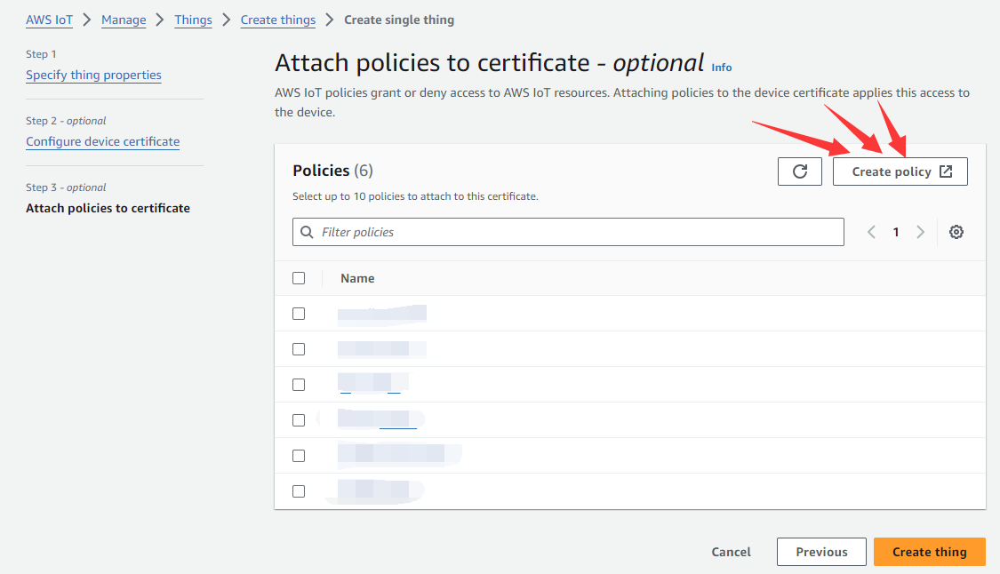

# AWS Configuration

1. **Create AWS account.**

   Create and log in to your account on the AWS platform: <https://aws.amazon.com/>.

2. **Create things and download certificates.**

   Select "IoT Core" service.

   

   Click "create things".

   

   Choose create single thing for example.

   

Enter the thing name , click "Next".

Auto-generate a new certficate, click "Next".

Click "Create Policy".

Enter the policy name, select JSON format, enter policy as follow:

{

"Version": "2012-10-17",

"Statement": [

{

"Effect": "Allow",

"Action": "iot:\*",

"Resource": "\*"

}

]

}

Click Create.

Choose the Policy just we created. Create thing.

Then download certification and key files.

Download all these 4 files, as follow.

3. **Set the URL of AWS MQTT server.**

   Click "Connect one device"

   

   Record the URL of AWS MQTT server(a2d911mzqj2e50-ats.iot.us-east-1.amazonaws.com) in the box, as follows.

Modify the setting.ini file, the value of "hostip" field set to "a2d911mzqj2e50-ats.iot.ap-south-1.amazonaws.com", refer to the following.

Modify the AWS default URL, Modify the macro definition "AWSMQTT\_URL" in the "player\_proc.c" file of the demo project,rebuild the project.

# define AWSMQTT\_URL “a2d911mzqj2e50-ats.iot.ap-south-1.amazonaws.com”

## Pack and download OTA package

1. Rename "AmazonRootCA1.pem" to "ca.pem"

2. Rename "xxx-certificate.pem.crt" to "cli.crt"

3. Rename "xxx-private.pem.key" to "pri.key"

   

4. Package and download the setting.ini file and these three certificate files(ca.pem、cli.crt、pri.key) to the device.

   (How to pack and download data files? Please refer to the document "Developer Environment Manual(ENG Mode).docx", part 4.OTA package(data and bin))

## Broadcast test

1. Subscribe to a topic, set topic: "/ota/\<sn\>/update" (where \<sn\> is the device serial number)

Publish to a topic, The test message as follow:

(Note: every time you send the message, please ensure that "request\_id" is unique)

{"broadcast\_type":1,"money":"1.23","request\_id":"2022081951495648","datetime":"20220819144051","ctime":1660891251}

