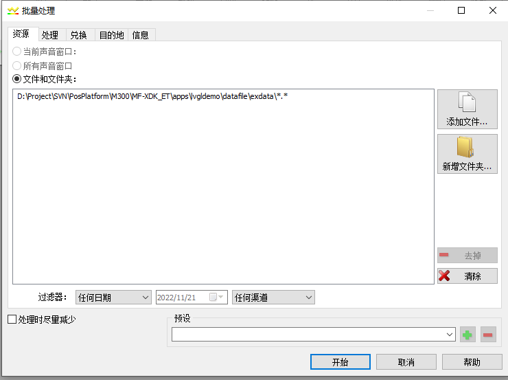
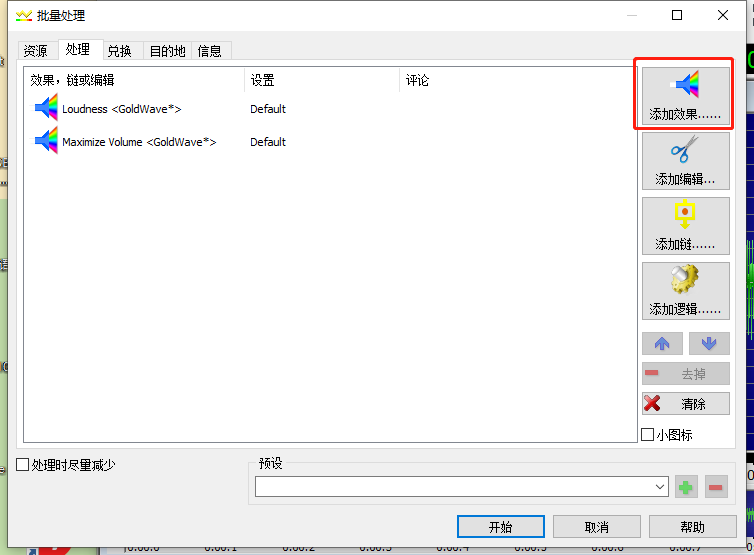
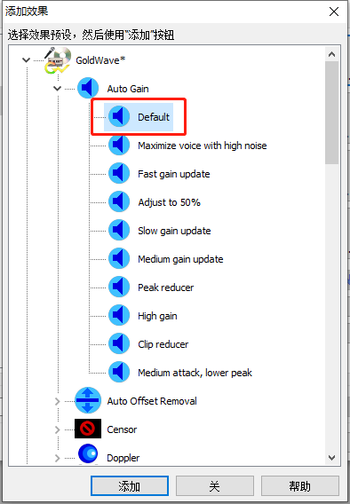
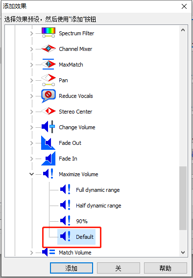
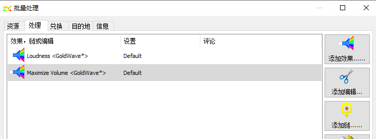
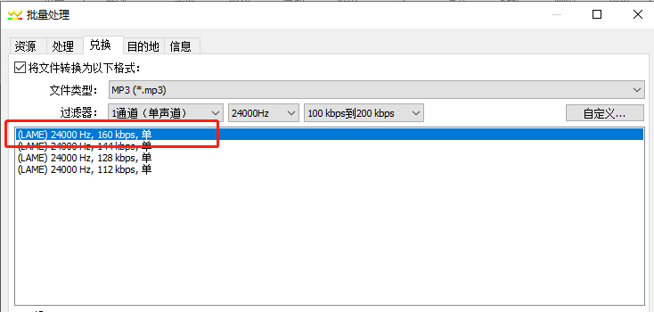
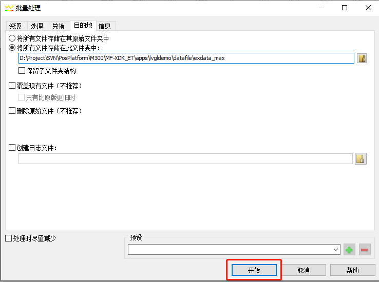

### Audio File Synthesis By Azure

1. **Generate MP3 audio files through Azure**

Website: <https://speech.microsoft.com/audiocontentcreation>

You need to register an Azure account first.

Log in to your Azure account, search for cognitive services on the 'All Services' page, and find voice services under Cognitive Services.

refer to: <https://learn.microsoft.com/zh-cn/azure/cognitive-services/speech-service/how-to-audio-content-creation>

Recommended choices for anchors: libby,export MP3 audio files.

2. **Adjusting audio properties through the GoldWave tool**

   2.1 Open the audio files with GoldWave, cut the excess audio at the head and tail.

   2.2 Adjust audio file volume to maximum through batch processing

      1. Select File - Batch Processing.

         Add folder path for pending audio files on the source page.

         

      2. Add effects on the process page.

         

         Auto Gain selection default.

         

         Maximize Volume selection default

         

         As follows:

         

      3. Save it as an MP3 file on exchange page, attribute selection: (LAME)24000HZ, 160kbps, single.

         

      4. Set the target folder path on destination page.

         Click 'Start' to perform batch conversion.

         
