**Catch AP&CP log**

1. Set command

Open tool sscom.exe,

select port “Quectel USB AT Port”, connect to the device and send the command “AT+QDBGCFG="tracecfg",0,2”. when the tool shows OK, it is success.

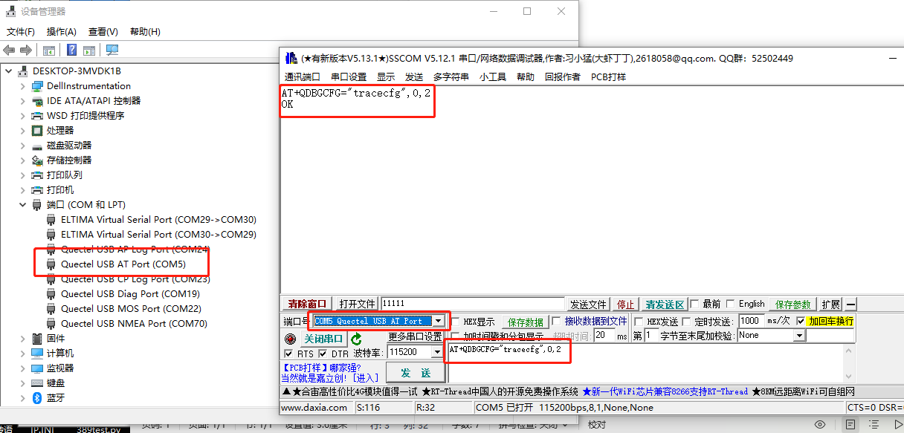

1. Open the tool coolwatcher\_usb.exe,

Find the "Quectel USB Ap Log Port" and set the corresponding port for lastport.Click ok button.

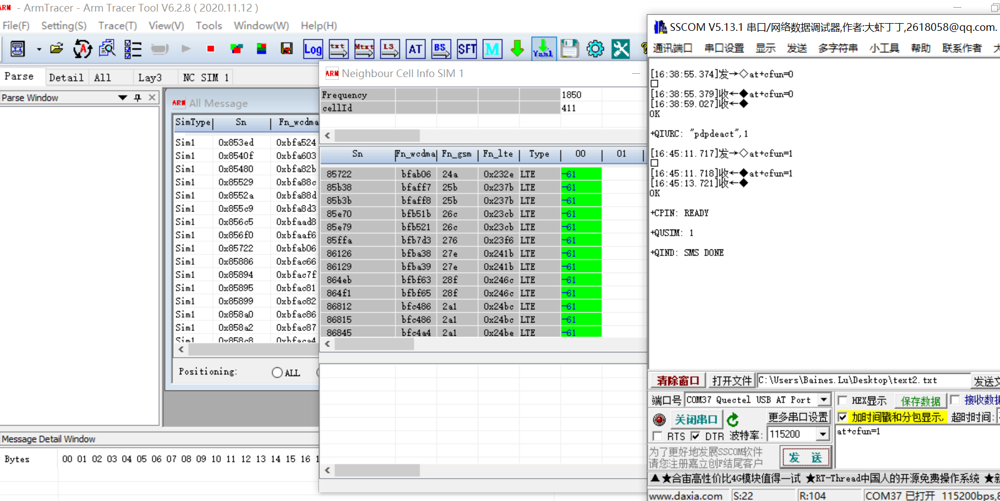

1. View Trace

As follow, Click <Plugins> —> <Activate Tracer> on menu bar, and activate Trace, shown as Figure

In the middle of the interface, Trace Index, Time that Trace Received by PC, Levels, and Descriptions can be obtained.

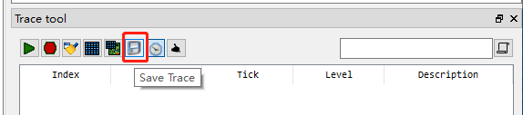

1. Trace Levels Setting

Click the forth button , which located at the trace main interface, set Trace Levels. 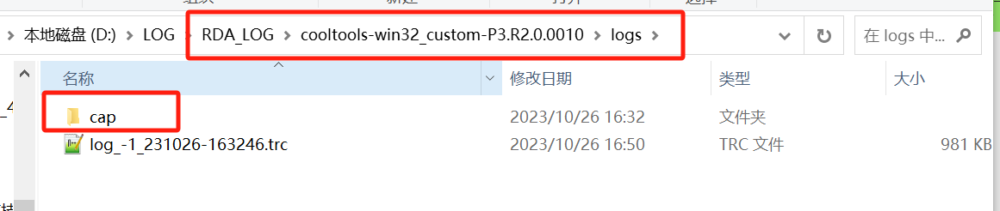

Click “save Pcap”

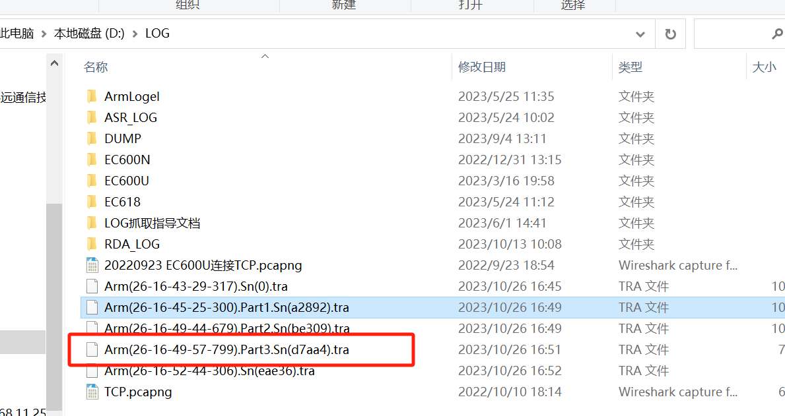

Click start button to start log .

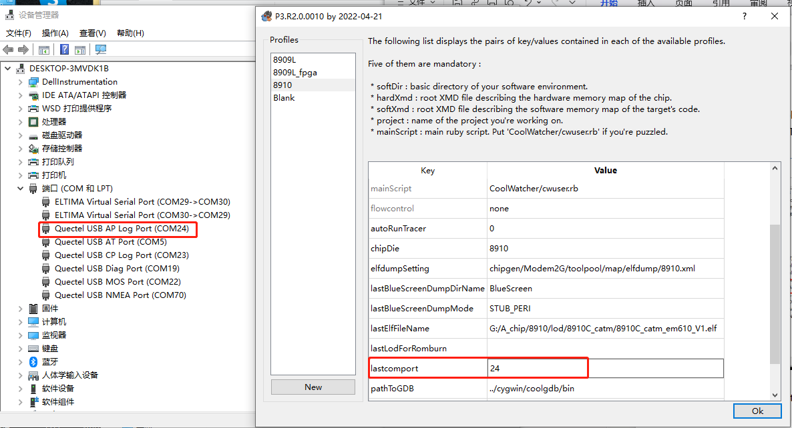

**Keep** the tool coolwatcher\_usb.exe running and catch cp log.

**Catch CP log**

1. Set command

Open tool sscom.exe,select port “Quectel USB AT Port”, connect to the device and send the command “at+cfun=0”.

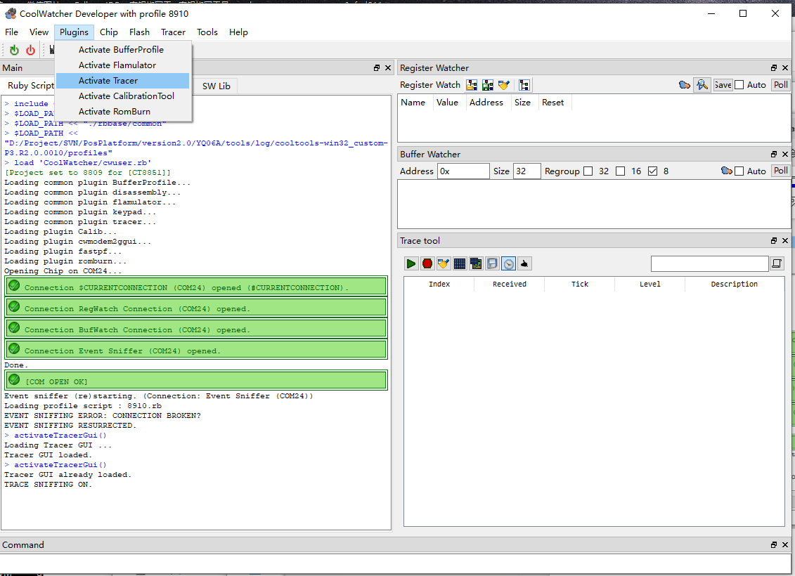

2.open the tool V6.2.8\_User\ArmTracer.exe,device port select “Quectel USB CP Log port”，click “ok”.

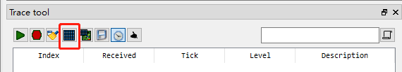

1. click “start trace function” button, set the log path and click “OK”。

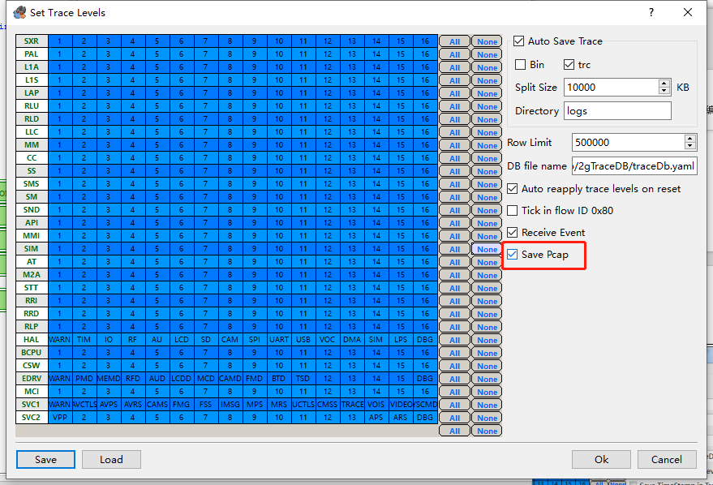

1. Keep tool ArmTracer running，Send “at+cfun=1” instruction through SSCOM tool，Log will output as following figure。

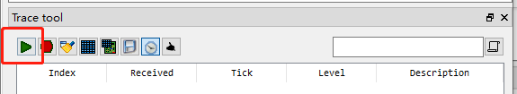

1. Test the IP. Send the follow commands through SSCOM tool.
2. AT+QPING=1,"8.8.8.8"
3. AT+QPING=1,"sg-mqtt.funicom.com.cn"
4. Save the log

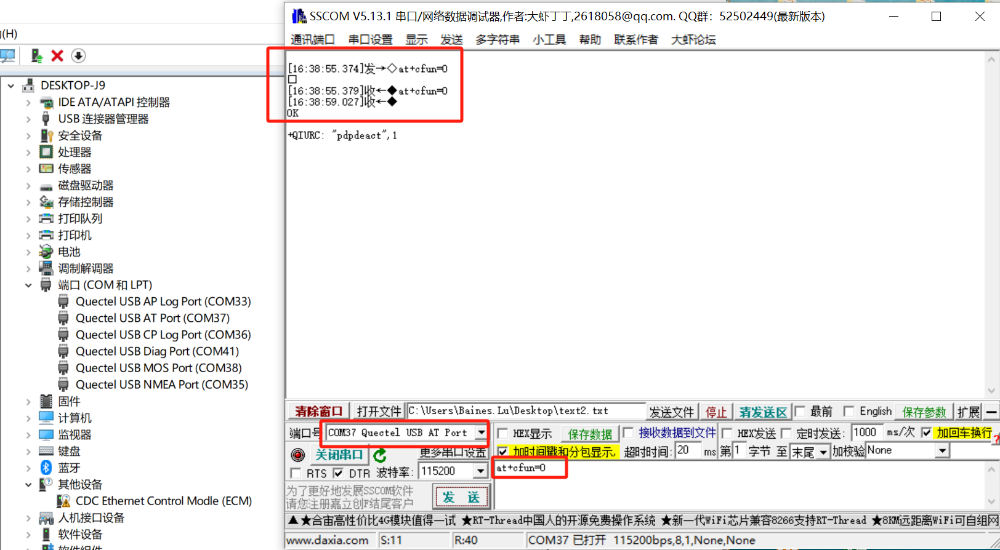

Share the cap folder under this path, as follow.

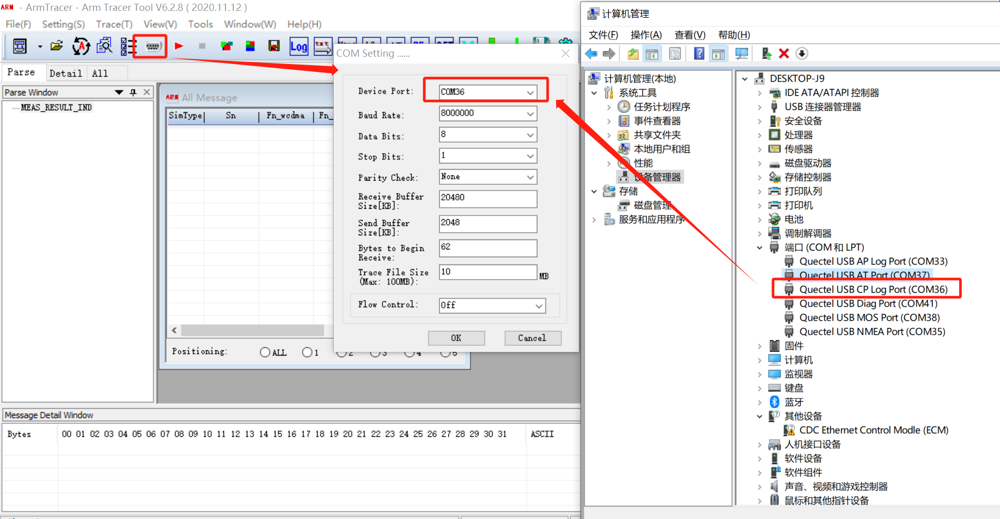

Stop ArmTracer log，share the .tra file under the set retention path。

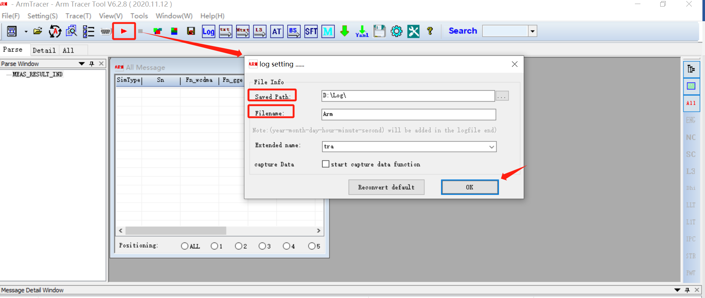
