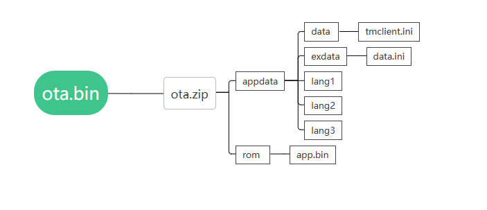
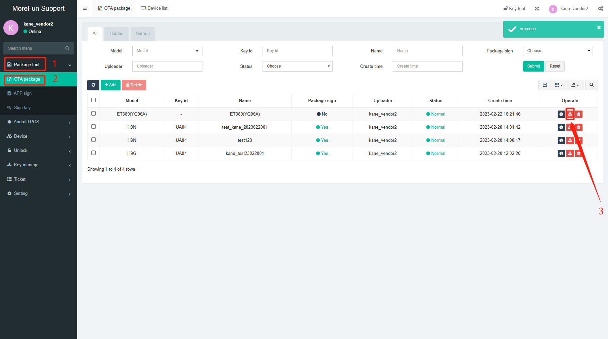
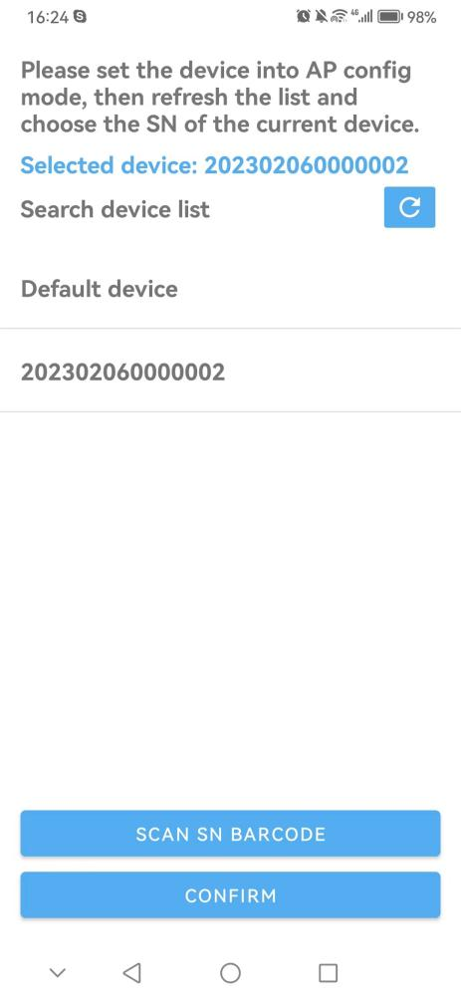
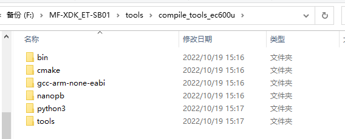

# Developer Environment Manual

## Drive installation

Go to the MF-XDK\_ET-1. Please note that **appdata** and **rom** in the zip **MUST BE ALL LOWERCASE**, mustn't be AppData or Rom, cause **Capital letters are forbidden**.

2. The Folder names of **appdata**, **data**, **exdata**, and **rom** cannot be changed, it is a fixed naming format.

3. **The ota.zip package DOES NOT need to include an ota folder,just compress the appdata and rom folder into ota.zip.**

    

### OTA Package Limitations

1. **In single OTA package, inside appdata directory there can be max 1024 files. If there is combination of files and folders then appdata can have (files + folder) sum of 1024 only.**

2. **If we need to keep folders/directories inside appdata then, appdata can have maximum 234 directories inside it.**

3. **It is recommended to limit 202 number of files inside each lang folder.**ers folder path, run download\_Quectel\_Windows\_USB\_Driver(U)\_For\_ECM\_RNDIS\_V1.0.13.bat to download the driver.

then install the driver.

After the driver is installed, it will shows NMEA port which you can download and debug programs.

## 

**Note:Serial port recognition requires a data cable instead of a matching charging cable which with the device.**

## Compilation

## **2.1** Compilation tools

Go to the directory MF-XDK\_ET-SB01\tools, run download\_compile\_tool.bat, automatically download and unzip compile\_tools\_ec600u.rar and cygwin.rar to the current directory.

Note: As shown in the figure, check if there are any extra directories in the folder directory.

## **2.2** Project Compilation

In the directory :MF-XDK\_ET-SB01\apps\SR600Mini, run the makefile.bat file.

The following prompts that the compilation is successful.

In the current project directory, the ota.bin and app.bin will be generated under the project directory, as follow:

# OTA package(data and bin)

Please note :this step is used to download programs and data. If you only need to download the program, you can skip OTA packaging and follow the '4. Download' step to directly download ota. bin.

All the data saved in the appdata folder.The bin file saved in rom folder.

Example:

## **3.1 appdata Folder**

The data folder places system data (like **tmclient.ini** file)

The exdata folder places application data. For example, MP3 audio files, PNG images, configuration files (like **data.ini** file)

Lang1, lang2,lang3,**Lang No...** folder could place language files.

Folders name such as lang1,lang2 and lang3 can be changed as needed, you could call the file “xxxxxxxx.xxx” or “xxxxxxxx”. As you could see, the name has a maximum size of 8 letters (Capital letter, Lowercase letter and numbers are ok, but don’t use symbols), and the suffix is no more than 3 letters.

The Audio file path:

MF-XDK\_ET-SB01\apps\SR600Mini\datafile

## **3.2** Rom Folder

After finish compiling,it will produc **app.bin and ota.bin** in the sdk.As below picture, **please choose the app.bin into the rom folder** .

Notes:

1. Please note that **appdata** and **rom** in the zip **MUST BE ALL LOWERCASE**, mustn’t be AppData or Rom, cause **Capital letters are forbidden**.
2. The Folder names of **appdata**, **data**, **exdata**, and **rom** cannot be changed, it is a fixed naming format.
3. **The ota.zip package DOES NOT need to include an ota folder,just compress the appdata and rom folder into ota.zip.**

 ****

1. **In single OTA package, inside appdata directory there can be max 1024 files. If there is combination of files and folders then appdata can have (files + folder) sum of 1024 only.**
2. **If we need to keep folders/directories inside appdata then, appdata can have maximum 234 directories inside it.**
3. **It is recommended to limit 202 number of files inside each lang folder.**

## **3.3** Web ota packaging(unsigned)

1. Unsigned ota package is for the bebug terminal.
2. Browser login to [https://support.morefun-et.com.If you don't have account,please contact morefun to create one for you.](https://support.morefun-et.com,if)
3. [Follow the steps in the figure below to upload the ota.zip file.](https://support.morefun-et.com,if)

1. [After successfully upload,please download the unsigned bin file from the support platform.](https://support.morefun-et.com,if)

## **[3.4](https://support.morefun-et.com,if)** [Web ota packaging(signed)](https://support.morefun-et.com,if)

[1.If there is a pub key in the terminal,the ota package should be signed,or it can not be download into the device.](https://support.morefun-et.com,if)

[2.Fill in the contents to generate the public key according to the steps in the following figure.](https://support.morefun-et.com,if)

[3.Follow the steps in the figure below to upload the ota.zip file to be signed and generate the signature file.](https://support.morefun-et.com,if)

[4. Download the signed file in the previous step (as shown below).](https://support.morefun-et.com,if)

# **Download**

1.Before downloading, you need to connect the terminal to the PC.

2.Press and hold the “M” button while rebooting the device(poke the device's restart button with a stick, as follow) to enter APP1 mode(ENG mode).

Ensure that the LCD shows “app1 mode”.The device will broadcast “app engineer mode”.

1. Run the MFToolSet tool(path:MF-XDK\_ET-SB01\tools\DownloadTool)
2. Select “Program Download” page.
3. Select configuration file ota.ini(path:apps\SR600Mini).
4. Click the download button to download the ota.bin.

Note: When Clear Data is checked, the data will be cleared.

Note: The .ini configuration file specifies the address of the program download and the path to the download program. SDK will provide a template for the configuration file. The contents of the configuration file ota.ini are as follows:

# Debug

## **5.1 Catch a log**

5.1.1 Reboot and press and hold the M key to start the device and enter the APP1 mode.

5.1.2 Connect the device to the pc,check the device manager,make sure the device successfully recognized by the computer. 

5.1.3 If you are using the download tool to update,please close the tool first,then run the tool ETEmulator.exe.Tool path:MF-XDK\_ET-SB01\tools\ETEmulatorTool

5.1.4 Choose the NEMA port showing in device manger,then enter below information in log dialog box.Then click start to display the log.Click “Set Log” button to set the log command:

logto=1 atc=0 net=0 app=0 iot=0 tms=0 wifi=0 app=0 grps=0 lib=0 app=0 product=0 rpc=0 power=0 pub=0 net=0 httpdownload=0 net=0 app=0 lvgl=0 bluetooth=0

5.1.5 Check log.

Click Log Directory button.The logs are saved in the corresponding log file

5.1.6 Disable log output

Set “logto=0” in the Log box(as the red step1 in picture),Click Set log button.

logto=1 :Enabling log printing

app=0 :Enable sys\_trace to print logs

emv=0 :Enable emv correlation to print logs

## **5.2 Display version number**

Enter the ENG mode first, Click “PRODUCE” to enter the production test menu. Select "+" "-" to move up and down.Select Version info and click M to view the version information.

****

# Network configuration

In WIFI mode, the menu “WIFI SETTING” can pop up the WiFi list for WiFi settings, please refer to the WiFi list demonstration video:MF-XDK\_ET-SB01\Documentation\video\ET389Pro\_wifiList.mp4(run download\_video.bat to download all demo video ).

The following are the steps for APK network distribution:

**6.1 Switch network mode**

1. Long press the "M" key for 2 seconds to enter the "Configure the Network" mode(timeout is 2 minutes) .
2. In this mode,press "-" button to select "4G",then press the power button, device will be "4G" mode (please insert the SIM card to use).
3. After the setting is complete, restart the speaker and the network mode setting is successful.
4. Press "+" button to select "WIFI",device will speak “WIFI configuration”,then we can configure the wifi with the phone.
5. The device remains in the states of the last successful network.

**6.2 WIFI network mode set by Android**

1. Install MFApLink-1.2.1-release.apk(path: MF-XDK\_ET-SB01\tools\WIFI setting), and accept all the permission requirements of this APK.
2. Long press the "M" key for 2 seconds to enter the "Configure Network Mode". In this mode, press "+" to set to “WIFI Network Mode”and enter WIFI configuration.

1. The mobile phone connect to the wifi which to be configured(only support 2.4GHz, not support 5GHz) .
2. Run MFApLink-1.2.1-release.apk, click “CONNECT”botton, input the correct password of the connected WIFI for configuration and make sure it is connected to the same WIFI as your phone. Click “CONNECT” button to continue.

1. In “Search device list”, find the corresponding AP name(the AP name is usually device sn or Default device).Select corresponding AP name and click “CONFIRM” button.Click Connect in the pop-up prompt box.

1. When APK prompts "AP link success!", it indicates that the the WIFI configuration is complete.Wait for the device to restart and confirm the WiFi network status.

1. Press M key on the device to check the network status and service connection status based on the broadcast content.

**6.3 WIFI network mode set by IOS**

1. Search “MFAPLink” in Apple AppStore and download to the IPhone.
2. Long press the "M" key for 2 seconds to enter the "Configure Network Mode". In this mode, press "+" to set to “WIFI Network Mode”and enter WIFI configuration.

1. Make sure your IPhone connected to a strong wifi signal. Open the MFAPLink app,you can see two mode showing on the screen.

1. Choose Default AP Mode

a.Allow MFAPLink to use your location, input the wifi and password you Iphone is connecting,and click connect. Then click Join when it asked as below.

b.When the app shows below status,it means the wifi connection is success. The device will say “configure successfully” and reboot. Then you can check the network status.

1. Scanning Mode

a.Make sure the machine enter WIFI configuration. Make sure your IPhone connected to a strong wifi signal. Choose Scanning Mode,and scan the bar code of the label on the back of the machine.

b.Enter the wifi and password your Iphone is connecting,click connect. When the app shows status in red box,it means the wifi connection is success. The device will say “configure successfully” and reboot. Then you can check the network status.

Notice:Only the system version V2.3.3 and later version, Wifi version V5.1.2 and later versions are support the Scanning Mode to configure wifi. Both are needed.

The system version V2.3.3 and before version, Wifi version V5.1.2 and before versions are support the Default AP Mode to configure wifi.Either is needed.

get below version information by tool ETEnumlator.exe.

# Display QR codes and push broadcasts

Install push test APK,(Path:MF-XDK\_ET-SB01\tools\apk\Sample-1.0.3.202312121540\_release.apk)

Select server default address:http:\\sg-iot.morefun-et.com, input serial number and amount, then click the button ”CREATE ORDER” to generate Qrcode.

Click the button ”SCAN” to scan the Qrcode on the screen, the device will broadcast the transaction amount.

Please refer to the video “MF-XDK\_ET-SB01\Documentation\video\SR600mini\_DQR.mp4”

(run download\_video.bat to download all demo video ).

# Audio format conversion

If the audio format is incorrect, the audio cannot be played properly.In serious cases, the device dump

We use the Tool GoldWave to convert the audio format,below is the download address.

https://www.goldwavechina.cn/xiazai.html

1. After installing the GoldWare software, run it and click on batch processing as below image shows.

   

2. Select all audio and click add button

   

3. Select the save path

   

4. As the picture shows, select (LAME) 16000Hz, 32kbps, mono, click the Begin button

   

## Audio File Synthesis

### Generate MP3 audio files through Azure

1. **Generate MP3 audio files through Azure**

Website: <https://speech.microsoft.com/audiocontentcreation>

You need to register an Azure account first.

Log in to your Azure account, search for cognitive services on the 'All Services' page, and find voice services under Cognitive Services.

refer to: <https://learn.microsoft.com/zh-cn/azure/cognitive-services/speech-service/how-to-audio-content-creation>

Recommended choices for anchors: libby, export MP3 audio files.

### Adjusting audio properties through the GoldWave tool

1. **Open the audio files with GoldWave, cut the excess audio at the head and tail.**

2. **Adjust audio file volume to maximum through batch processing**

   - Select File - Batch Processing

   - Add folder path for pending audio files on the source page.

- Add effects on the process page.

Auto Gain selection default.

Maximize Volume selection default

As follows:

- Save it as an MP3 file on exchange page, attribute selection: (LAME)24000HZ, 160kbps, single.

c. Set the target folder path on destination page. Click 'Start' to perform batch conversion.

## **Appendix**

1. Question: How to format files?

Open tool ETEnumlator.exe,enter Engineering mode,press "PRODUCE" key enter produce mode,select "Format file".

